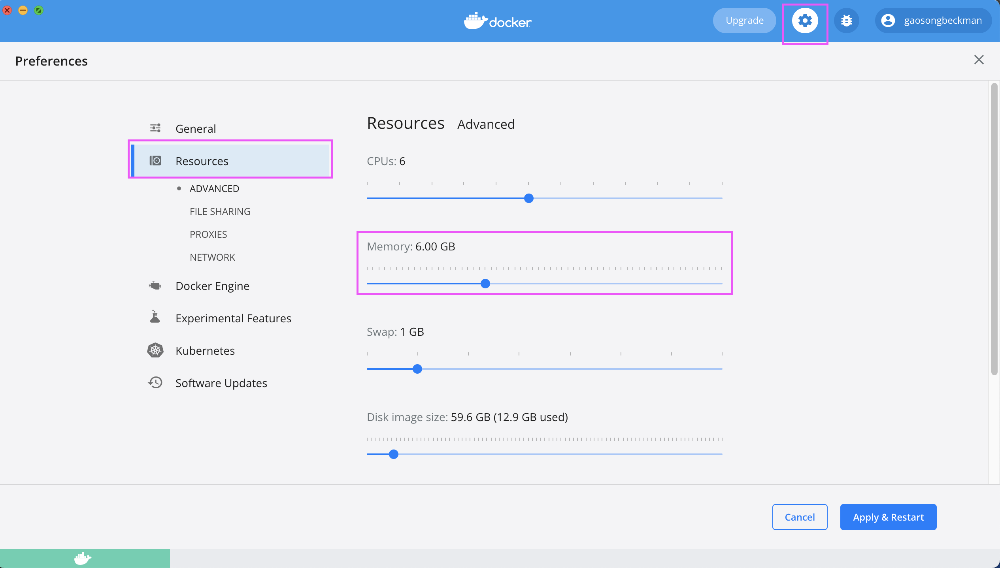

# Running airflow in docker

- [ ] install docker-compose
  ```shell
  pip install docker-compose
  ```
- [ ] check if there is enough memory. (at least 4GB, ideally 8GB)
  ```shell
  docker run --rm "debian:buster-slim" bash -c 'numfmt --to iec $(echo $(($(getconf _PHYS_PAGES) * $(getconf PAGE_SIZE))))'
  ```
- [ ] Allocate at least 4GB memory for docker engine
  
- [ ] Build custom image
  ```shell
  docker build -t my-airflow .
  ```
- [ ] Set $AIRFLOW_UID
  ```shell
  echo -e "AIRFLOW_UID=$(id -u)" > .env
  ```
- [ ] Initialize the database 
  ```shell
  docker-compose up airflow-init
  ```
- [ ] Running airflow
  ```shell
  docker-compose up 
  ```
- [ ] Stopping airflow
  ```shell
  control + C
  Or
  docker-compose down
  ```

# Install development dependencies
**'3.9'** is the version of the Python.
```shell
pip install "apache-airflow[celery]==2.2.5" --constraint "https://raw.githubusercontent.com/apache/airflow/constraints-2.2.5/constraints-3.9.txt"
```

```shell
pip install apache-airflow-providers-docker
```
